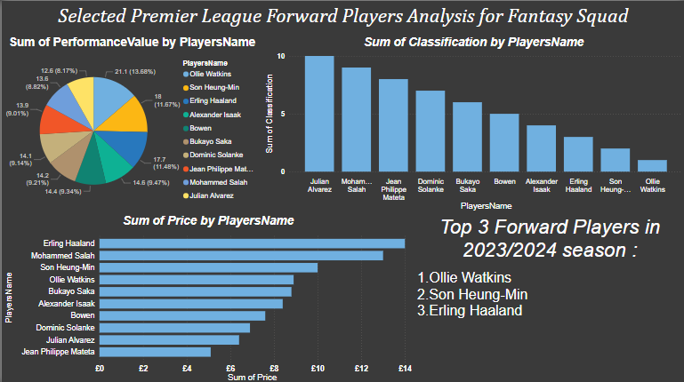
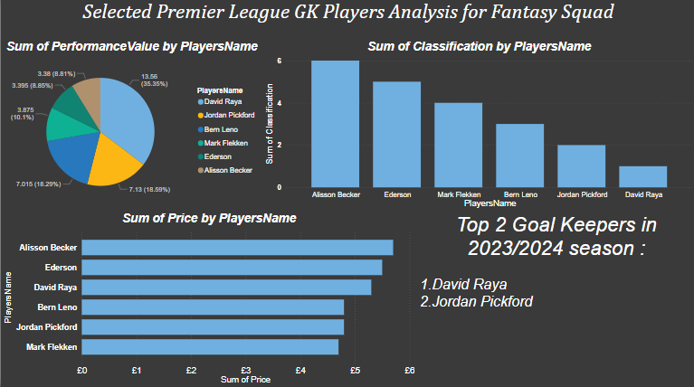
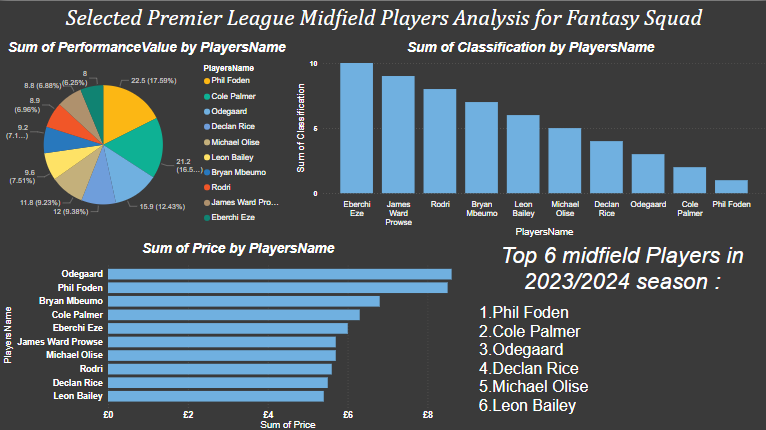
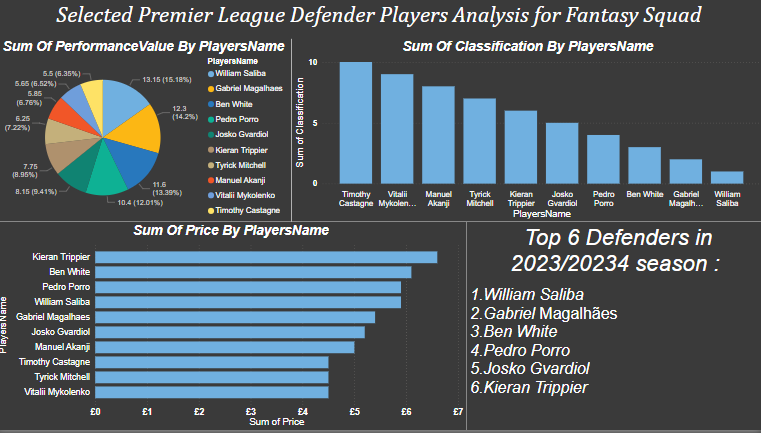

# FantasyPLPlayersPerformanceAnalysis

## Overview
This project analyzes the performance of Premier League players for the 2023/2024 season to help build an optimized Fantasy Football squad. The analysis is conducted using data collected in Excel and visualized in Power BI.

## Objectives
- Collect and prepare data on Premier League players.
- Analyze player performance using key metrics.
- Visualize insights using Power BI to help select the best players for a fantasy squad.

## Tools and Technologies
- Excel for data collection and preparation.
- Power BI for data visualization.

## Project Files
- `FantasyPLPlayerSelection2023_2024.xlsx`: Contains the initial selection of players and their stats.
- `FantasyPLChosenPlayers2023_2024.xlsx`: Contains the data of the chosen players for analysis.
- `FantasyPLPlayersPerformanceAnalysis.pbix`: Power BI file with the visualizations.

## Key Findings
- Top performing players in different positions.
- Correlation between player value and performance.

## How to Use
1. Clone the repository.
2. Open the Excel files in the `Data` folder to review the raw data.
3. Open the Power BI `.pbix` file in the `PowerBI` folder to explore the visualizations.

## Screenshots

## Conclusion
This project demonstrates the use of data analysis and visualization to derive insights for building a fantasy football squad. It showcases skills in data collection, preparation, and visualization using Excel and Power BI.
